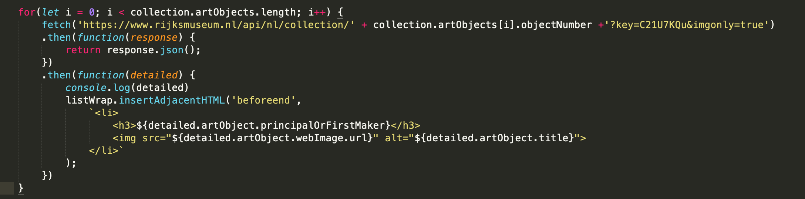
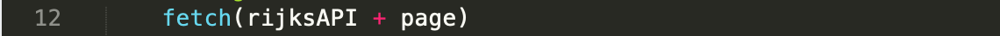
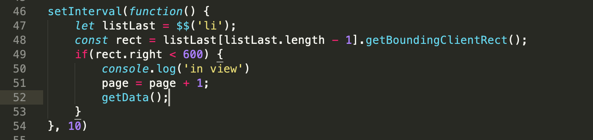

# Mijn Web App - Rijksmuseum

Ik heb voor het Rijksmuseum gekozen als opdracht. De user story van deze opdracht luidt: 
> As an art lover, I want to be able to search and view art from the Rijksmuseum at home, so that I can still enjoy art during a lockdown. [Rijksmuseum - RijksData API](https://data.rijksmuseum.nl/object-metadata/)

## Inzichten

### Hoe je de detailspagina van een specifiek object naar boven haalt.

### Nieuwe pagina laden 

Door deze interval wordt er gecheckt of het 4e 'li' element in beeld is. Als deze in beeld is worden de volgende 5 items uit de API geladen. Het nadeel is dat ik hier een interval gebruik waardoor hij aan het begin al teveel elementen laadt. Het liefst gebruik ik het 'scroll' event, maar omdat het een horizontale scroll is, wordt het niet gezien als scroll.

